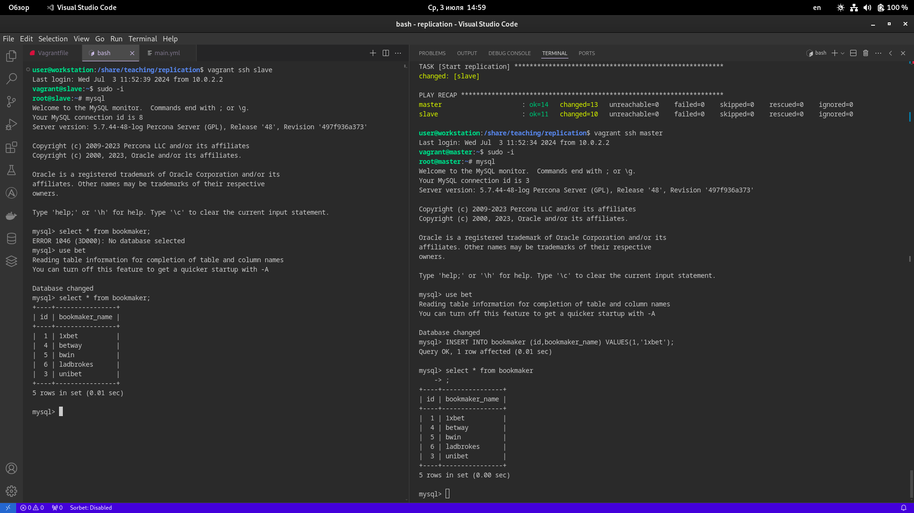
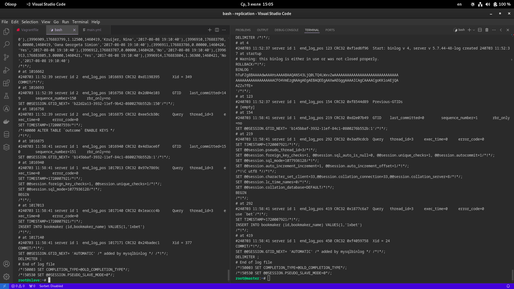

Домашнее задание:
```
MySQL репликация
```

Цель домашнего задания:
```
Научиться создавать репликацию MySQL
```

Описание домашнего задания
~~~
Базу развернуть на мастере и настроить так, чтобы реплицировались таблицы:

| bookmaker |
| competition |
| market |
| odds |
| outcome

Настроить GTID репликацию

Варианты, которые принимаются к сдаче

    1.  рабочий вагрантафайл
    2.  скрины или логи SHOW TABLES
    3.  конфиги*

пример в логе изменения строки и появления строки на реплике*
~~~

В данном ДЗ был использован Debian 12.

Вся настройка выполнена с помощью Ansible. В нём есть модуль ```community.mysql```, который позволяет выполнить все задачи, указанные в домашнем задании.

Установка Percona заняла чуть больше времени, чем планировалось. Изначально использовался мануал, указанный на сайте разработчика для [нужной нам](https://docs.percona.com/percona-server/5.7/installation/apt_repo.html#installing-percona-server-for-mysql-from-percona-apt-repository) версии, однако в какой-то момент мануал перестал работать, причем изменения в данную часть плейбука не вносилась. Пришлось воспользоваться мануалом для [последней](https://docs.percona.com/percona-server/8.0/apt-repo.html#install-percona-server-for-mysql-using-apt) версии. Различия состоят в том, что в первом случае надо было всего лишь скачать файл релиза, установить репозиторий с его помощью и затем установить сам сервер, а теперь необходимо после установки репозитория еще дополнительно включать нужный нам репозиторий. делается это с помощью команды
```
percona-release enable ps-57
```

Лишь только после этого появляется возможность установить сервер указанной в ДЗ версии.

Примечание. В ДЗ сказано, что установщик автоматически генерирует пароль для root'а, однако при запуске плейбука пароль не сгенерировался, он остался пустым. Поэтому смысла менять пароль смысла нет, проще указать сокет для подключения к локальной БД. Данное замечание использовано в плейбуке при использовании модуля ```community.mysql```.

На сайте разработчика при установке указана следующая информация:

```Дистрибутив Percona Server for MySQL содержит несколько полезных пользовательских функций (UDF) из Percona Toolkit. После завершения установки необходимо выполнить следующие команды, чтобы создать эти функции:```

```
$ mysql -e "CREATE FUNCTION fnv1a_64 RETURNS INTEGER SONAME 'libfnv1a_udf.so'"
$ mysql -e "CREATE FUNCTION fnv_64 RETURNS INTEGER SONAME 'libfnv_udf.so'"
$ mysql -e "CREATE FUNCTION murmur_hash RETURNS INTEGER SONAME 'libmurmur_udf.so'"
```
Данный модуль также включен в плейбук.

Скриншот демонстрации работы репликации в консоли (слева - слейв, справа - мастер):



Скриншот демонстрации работы репликации в бинлогах (слева - слейв, справа - мастер):


